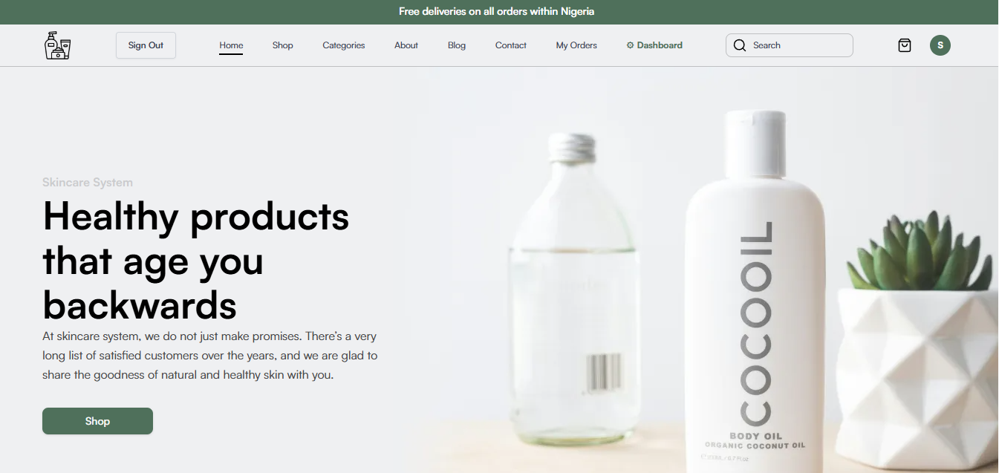

# SKCare — Skincare E-Commerce Platform



> **Healthy products that age you backwards.**
> At SKCare, we do not just make promises. There is a very long list of satisfied customers over the years, and we are glad to share the goodness of natural and healthy skin with you.

🌐 **Live Demo:** [https://skcare-app.vercel.app](https://skcare-app.vercel.app)

---

## Table of Contents

- [Overview](#overview)
- [Features](#features)
- [Tech Stack](#tech-stack)
- [Project Structure](#project-structure)
- [Getting Started](#getting-started)
- [Environment Variables](#environment-variables)
- [API Reference](#api-reference)
- [Role & Permission System](#role--permission-system)
- [Payment Integration](#payment-integration)
- [Security](#security)
- [Scalability](#scalability)
- [Deployment](#deployment)
- [Seed Scripts](#seed-scripts)
- [Contributing](#contributing)
- [Licence](#licence)

---

## Overview

SKCare is a full-stack e-commerce web application built for a Nigerian skincare brand. It allows customers to browse products, add them to cart without signing up, and complete checkout with card payment via Flutterwave. The platform includes a full admin dashboard for managing products, orders, customers, and staff accounts.

The system is designed with production-grade security, role-based access control, and scalability in mind — suitable for growing from a small business to a high-traffic operation without major architectural changes.

---

## Features

### Customer-Facing

- 🛍 **Browse & Shop** — Product listings with pagination, search, and category filtering
- 🛒 **Frictionless Cart** — Add to cart without signing up; cart stored in `sessionStorage`
- 🔐 **Secure Authentication** — Email/password sign-up and sign-in with JWT + refresh token rotation
- 📦 **Checkout Flow** — Registration, shipping details, and card payment in one seamless flow
- 💳 **Flutterwave Payment** — Card, USSD, and bank transfer via Flutterwave inline checkout
- 📋 **Order Tracking** — Real-time order progress tracker (Processing → Confirmed → Shipped → Delivered)
- 🔁 **Cart Preserved on Failed Payment** — Cart is only cleared after payment is confirmed
- ⏱ **Idle Session Timeout** — Auto sign-out after 30 minutes of inactivity (shared device protection)

### Admin Dashboard

- 📊 **Dashboard Overview** — Live stats: revenue, orders, customers, products
- 📦 **Product Management** — Upload, update, inline price/qty editing, soft-delete
- 🛍 **Order Management** — View all orders, filter by status, update order and payment status
- 👥 **Customer Management** — View registered customers, search, delete
- 🔐 **Staff Management** — Create staff accounts, assign roles, view permission matrix
- 🔒 **Role-Based Access** — Superadmin, Admin, Staff hierarchy with granular permissions

---

## Tech Stack

### Frontend
| Technology | Purpose |
|---|---|
| React 18 + TypeScript | UI framework |
| Vite | Build tool and dev server |
| Tailwind CSS | Utility-first styling |
| React Router v7 | Client-side routing |
| React Hook Form | Form state management |
| Axios | HTTP client |
| Flutterwave React SDK | Payment modal |
| shadcn/ui + Radix UI | UI component library |
| Embla Carousel | Product carousel |

### Backend
| Technology | Purpose |
|---|---|
| Node.js + Express.js | REST API server |
| MongoDB + Mongoose | Database and ODM |
| bcryptjs | Password hashing (cost factor 12) |
| jsonwebtoken | JWT access and refresh tokens |
| express-validator | Input validation and sanitisation |
| express-rate-limit | Rate limiting and brute-force protection |
| cookie-parser | httpOnly refresh token cookie handling |
| compression | Gzip response compression |
| multer | Multipart file upload handling |
| Cloudinary | Image storage and CDN delivery |
| flutterwave-node-v3 | Server-side payment verification |

### Infrastructure
| Service | Purpose |
|---|---|
| Vercel | Frontend hosting and CDN |
| Render | Backend API hosting |
| MongoDB Atlas | Cloud database (M0 free tier) |
| Cloudinary | Image storage |
| Flutterwave | Payment gateway |

---

## Project Structure

```
skcare-app/
├── skcare-api/                  # Express.js REST API
│   ├── controller/              # Route controllers
│   │   ├── authController.js
│   │   ├── cartController.js
│   │   ├── flutterwaveController.js
│   │   ├── orderController.js
│   │   ├── productController.js (inline in routes)
│   │   └── userController.js
│   ├── middleware/
│   │   ├── authMiddleware.js    # JWT verification
│   │   ├── errorHandler.js      # Centralised error handling
│   │   ├── requireAdmin.js      # Admin role guard
│   │   ├── requireRole.js       # Hierarchy role guard
│   │   └── validate.js          # express-validator rules
│   ├── models/
│   │   ├── Carts.js
│   │   ├── Order.js
│   │   ├── PaymentTransaction.js
│   │   ├── Product.js
│   │   └── Users.js
│   ├── routes/
│   │   ├── authRoutes.js
│   │   ├── cartRoutes.js
│   │   ├── flutterwaveRoutes.js
│   │   ├── orderRoutes.js
│   │   ├── productRoutes.js
│   │   └── userRoutes.js
│   ├── scripts/
│   │   └── seedSuperAdmin.js    # One-time superadmin setup
│   ├── config/
│   │   └── cloudinaryConfig.js
│   ├── app.js                   # Express app entry point
│   └── package.json
│
├── skcare-frontend/             # React + TypeScript SPA
│   ├── src/
│   │   ├── admin/
│   │   │   ├── components/      # Admin panel components
│   │   │   └── pages/Admin.tsx  # Admin layout and sidebar
│   │   ├── components/
│   │   │   ├── landingpage/     # Hero, ProductList, Carousel
│   │   │   ├── ui/              # shadcn components
│   │   │   ├── AuthButton.tsx
│   │   │   ├── AuthModal.tsx
│   │   │   ├── NavBar.tsx
│   │   │   ├── ProtectedRoute.tsx
│   │   │   └── ShadMobileNav.tsx
│   │   ├── context/
│   │   │   ├── AuthContext.tsx  # JWT auth state
│   │   │   ├── CartContext.tsx  # Cart state (local + DB)
│   │   │   └── ProductContext.tsx
│   │   ├── hooks/
│   │   │   └── useDebounce.ts
│   │   ├── pages/
│   │   │   ├── AllProducts.tsx  # Product listing with search
│   │   │   ├── CartPreviewPage.tsx
│   │   │   ├── Checkout.tsx
│   │   │   ├── LandingPage.tsx
│   │   │   ├── Orders.tsx       # User order history + tracker
│   │   │   └── SingleProduct.tsx
│   │   └── App.tsx
│   └── package.json
│
├── docs/
│   └── banner.png
├── SCALABILITY.md
└── README.md
```

---

## Getting Started

### Prerequisites

- Node.js v18+
- MongoDB (local install or Atlas account)
- Cloudinary account
- Flutterwave account (test keys)

### 1. Clone the repository

```bash
git clone https://github.com/your-username/skcare-app.git
cd skcare-app
```

### 2. Install backend dependencies

```bash
cd skcare-api
npm install
```

### 3. Install frontend dependencies

```bash
cd ../skcare-frontend
npm install
```

### 4. Set up environment variables

See [Environment Variables](#environment-variables) below. Create `.env` files in both `skcare-api/` and `skcare-frontend/`.

### 5. Start MongoDB

If running locally, start MongoDB in a separate terminal:

```cmd
"C:\Program Files\MongoDB\Server\8.0\bin\mongod.exe" --dbpath "C:\Program Files\MongoDB\Server\8.0\data" --port 27017
```

### 6. Seed the superadmin

```bash
cd skcare-api
npm run seed:superadmin
```

### 7. Start the development servers

**API (terminal 1):**
```bash
cd skcare-api
npm run dev
```

**Frontend (terminal 2):**
```bash
cd skcare-frontend
npm run dev
```

Visit [http://localhost:5173](http://localhost:5173) in your browser.

---

## Environment Variables

### Backend — `skcare-api/.env`

```env
PORT=5000
NODE_ENV=development

# MongoDB
MONGO_URI=mongodb://localhost:27017/skcareDB

# JWT
JWT_SECRET=your_64_char_random_hex_string
JWT_REFRESH_SECRET=your_other_64_char_random_hex_string
JWT_EXPIRES_IN=2h
JWT_REFRESH_EXPIRES_IN=7d

# Cloudinary
CLOUDINARY_CLOUD_NAME=your_cloud_name
CLOUDINARY_API_KEY=your_api_key
CLOUDINARY_API_SECRET=your_api_secret

# Flutterwave
FLW_PUBLIC_KEY=FLWPUBK_TEST-xxxxxxxxxxxxxxxxxxxxxxxxxxxxxxxx-X
FLW_SECRET_KEY=FLWSECK_TEST-xxxxxxxxxxxxxxxxxxxxxxxxxxxxxxxx-X
FLW_SECRET_HASH=your_webhook_secret_hash
FLW_BASE_URL=https://api.flutterwave.com/v3

# Superadmin credentials (used by seed script only)
SUPERADMIN_EMAIL=superadmin@yourstore.com
SUPERADMIN_PASSWORD=YourStrongPassword@1
SUPERADMIN_NAME=Super Admin

# Scalability
MONGO_POOL_SIZE=10
ALLOWED_ORIGINS=http://localhost:5173
```

Generate JWT secrets:
```bash
node -e "console.log(require('crypto').randomBytes(64).toString('hex'))"
```

### Frontend — `skcare-frontend/.env`

```env
VITE_APP_API_BASE_URL=http://localhost:5000
VITE_ALL_PRODUCTS_URL=http://localhost:5000/api/products
VITE_CART_API_URL=http://localhost:5000/api/carts
VITE_FLW_PUBLIC_KEY=FLWPUBK_TEST-xxxxxxxxxxxxxxxxxxxxxxxxxxxxxxxx-X
```

---

## API Reference

### Authentication

| Method | Endpoint | Access | Description |
|---|---|---|---|
| POST | `/api/auth/signup` | Public | Register a new account |
| POST | `/api/auth/signin` | Public | Sign in and receive tokens |
| POST | `/api/auth/refresh` | Public (cookie) | Rotate refresh token |
| POST | `/api/auth/register-checkout` | Public | Register + save cart in one request |
| POST | `/api/auth/signout` | Auth | Sign out current session |
| POST | `/api/auth/signout-all` | Auth | Invalidate all sessions |

### Products

| Method | Endpoint | Access | Description |
|---|---|---|---|
| GET | `/api/products` | Public | List products (paginated, filterable) |
| GET | `/api/products/:id` | Public | Get single product |
| POST | `/api/products` | Staff+ | Upload new product |
| PUT | `/api/products/:id` | Staff+ | Update product details |
| PATCH | `/api/products/:id/image` | Staff+ | Replace product image |
| DELETE | `/api/products/:id` | Superadmin | Soft-delete product |

### Cart

| Method | Endpoint | Access | Description |
|---|---|---|---|
| GET | `/api/carts` | Auth | Get current user's cart |
| POST | `/api/carts/items` | Auth | Add items to cart |
| PUT | `/api/carts/items/:productId` | Auth | Update item quantity |
| DELETE | `/api/carts/items/:productId` | Auth | Remove item |
| DELETE | `/api/carts` | Auth | Clear entire cart |
| PUT | `/api/carts/shipping` | Auth | Save shipping details |
| POST | `/api/carts/checkout` | Auth | Create pending order |

### Orders

| Method | Endpoint | Access | Description |
|---|---|---|---|
| GET | `/api/orders` | Auth | Get own order history |
| GET | `/api/orders/:id` | Auth / Admin | Get single order |
| PATCH | `/api/orders/:id/cancel` | Auth | Cancel own order |
| GET | `/api/orders/admin/all` | Admin+ | All orders with filters |
| GET | `/api/orders/admin/stats` | Admin+ | Aggregated dashboard stats |
| PATCH | `/api/orders/:id/status` | Admin+ | Update order/payment status |

### Payment

| Method | Endpoint | Access | Description |
|---|---|---|---|
| POST | `/api/flutterwave/initiate-payment` | Auth | Create payment transaction |
| GET | `/api/flutterwave/verify/:transaction_id` | Public | Verify payment by transaction ID |
| GET | `/api/flutterwave/transaction-status/:tx_ref` | Auth | Poll transaction status |
| POST | `/api/flutterwave/webhook` | Public (signed) | Receive Flutterwave notifications |

### Users

| Method | Endpoint | Access | Description |
|---|---|---|---|
| GET | `/api/users/me` | Auth | Get own profile |
| PUT | `/api/users/me` | Auth | Update own profile |
| GET | `/api/users` | Staff+ | List users (paginated) |
| GET | `/api/users/:id` | Staff+ | Get user by ID |
| PUT | `/api/users/:id/role` | Admin+ | Update user role |
| POST | `/api/users/staff` | Superadmin | Create staff account |
| DELETE | `/api/users/:id` | Superadmin | Delete user account |

---

## Role & Permission System

SKCare uses a 4-level role hierarchy:

```
superadmin  ──►  Full access to everything
    │
admin       ──►  Manage orders, customers, update product details
    │
staff       ──►  Upload/update products, view orders
    │
user        ──►  Shop, checkout, view own orders
```

| Action | User | Staff | Admin | Superadmin |
|---|:---:|:---:|:---:|:---:|
| Browse and purchase | ✓ | ✓ | ✓ | ✓ |
| Upload products | ✗ | ✓ | ✓ | ✓ |
| Update products | ✗ | ✓ | ✓ | ✓ |
| Delete products | ✗ | ✗ | ✗ | ✓ |
| View all orders | ✗ | ✓ | ✓ | ✓ |
| Update order status | ✗ | ✗ | ✓ | ✓ |
| View customers | ✗ | ✗ | ✓ | ✓ |
| Create staff | ✗ | ✗ | ✗ | ✓ |
| Assign admin roles | ✗ | ✗ | ✗ | ✓ |
| Delete user accounts | ✗ | ✗ | ✗ | ✓ |

---

## Payment Integration

SKCare uses **Flutterwave** for all payment processing.

### Flow

```
Cart → Checkout Form → POST /api/carts/checkout (pending order)
    → POST /api/flutterwave/initiate-payment (get tx_ref)
    → Flutterwave inline modal (card/USSD/bank transfer)
    → GET /api/flutterwave/verify/:transaction_id (public verify)
    → Order confirmed → Cart cleared → Navigate to home
```

### Key design decisions

- **Secret key is server-side only** — never exposed to the browser
- **Client callback is never trusted** — server always re-verifies via Flutterwave API
- **Webhook signature verified** with timing-safe comparison
- **Cart preserved on failure** — only cleared after confirmed successful payment
- **Idempotency** — duplicate webhook events are ignored

### Test card details

```
Card number : 5531 8866 5214 2950
Expiry      : 09/32
CVV         : 564
PIN         : 3310
OTP         : 12345
```

---

## Security

| Measure | Implementation |
|---|---|
| Password hashing | bcryptjs, cost factor 12 |
| Access tokens | JWT, 2-hour expiry, `sessionStorage` |
| Refresh tokens | httpOnly cookie, 7-day expiry, rotation on use |
| Reuse detection | Wipes all sessions on token reuse (theft indicator) |
| Input validation | express-validator on all endpoints |
| Parameterised queries | Mongoose ODM throughout |
| Rate limiting | 200 req/15min (API), 20 req/15min (auth) |
| CORS | Explicit origin whitelist |
| Error messages | Generic client messages, full detail server-side only |
| Idle timeout | Auto sign-out after 30 minutes of inactivity |
| Stock race conditions | Atomic `findOneAndUpdate` with `$gte` guard |
| Secrets | All secrets in `.env`, excluded from version control |

---

## Scalability

See [SCALABILITY.md](./SCALABILITY.md) for the full upgrade guide. Key highlights:

- **Stateless JWT** — horizontal scaling ready
- **MongoDB connection pool** — configurable via `MONGO_POOL_SIZE`
- **Gzip compression** — ~70% bandwidth reduction
- **HTTP caching** — product listings cached 60s at CDN edge
- **Compound DB indexes** — fast queries at any order volume
- **Aggregation pipeline** — dashboard stats are O(1) regardless of data size
- **Redis upgrade path** — documented for multi-instance rate limiting

Current capacity estimate: **~10,000 users/day** on a single Render instance + Atlas M0.

---

## Deployment

### Backend (Render)

1. Connect your GitHub repository to Render
2. Set **Build Command:** `npm install`
3. Set **Start Command:** `node app.js`
4. Add all environment variables from `skcare-api/.env` in the Render dashboard
5. Set `NODE_ENV=production`
6. Render will auto-deploy on every push to `main`

### Frontend (Vercel)

1. Connect your GitHub repository to Vercel
2. Set **Root Directory:** `skcare-frontend`
3. Set **Build Command:** `npm run build`
4. Add all `VITE_*` environment variables in Vercel Project Settings
5. Vercel auto-deploys on every push

### Production environment variables to set

**On Render:**
```
NODE_ENV           = production
MONGO_URI          = mongodb+srv://...
JWT_SECRET         = (64-char hex)
JWT_REFRESH_SECRET = (64-char hex)
ALLOWED_ORIGINS    = https://skcare-app.vercel.app
FLW_PUBLIC_KEY     = FLWPUBK_LIVE-...
FLW_SECRET_KEY     = FLWSECK_LIVE-...
```

**On Vercel:**
```
VITE_APP_API_BASE_URL = https://your-api.onrender.com
VITE_FLW_PUBLIC_KEY   = FLWPUBK_LIVE-...
```

---

## Seed Scripts

### Create superadmin account

Set `SUPERADMIN_EMAIL`, `SUPERADMIN_PASSWORD`, and `SUPERADMIN_NAME` in `skcare-api/.env`, then run:

```bash
cd skcare-api
npm run seed:superadmin
```

This creates the initial superadmin account. Running it again is safe — it detects an existing account and skips creation.

**Default credentials (change before use):**
```
Email    : superadmin@skcare.com
Password : SuperAdmin@2024!
```

Sign in via the normal login modal on the website. The admin dashboard will be accessible from the navigation bar.

---

## Contributing

1. Fork the repository
2. Create a feature branch: `git checkout -b feature/your-feature`
3. Commit your changes: `git commit -m 'feat: add your feature'`
4. Push to the branch: `git push origin feature/your-feature`
5. Open a Pull Request

Please ensure your code follows the existing patterns and does not introduce new dependencies without discussion.

---

## Licence

This project is licensed under the **ISC Licence**. See the [LICENSE](./LICENSE) file for details.

---

<div align="center">

Built with ❤️ for Nigerian skincare lovers

[Live Demo](https://skcare-app.vercel.app) · [Report a Bug](https://github.com/your-username/skcare-app/issues) · [Request a Feature](https://github.com/your-username/skcare-app/issues)

</div>
